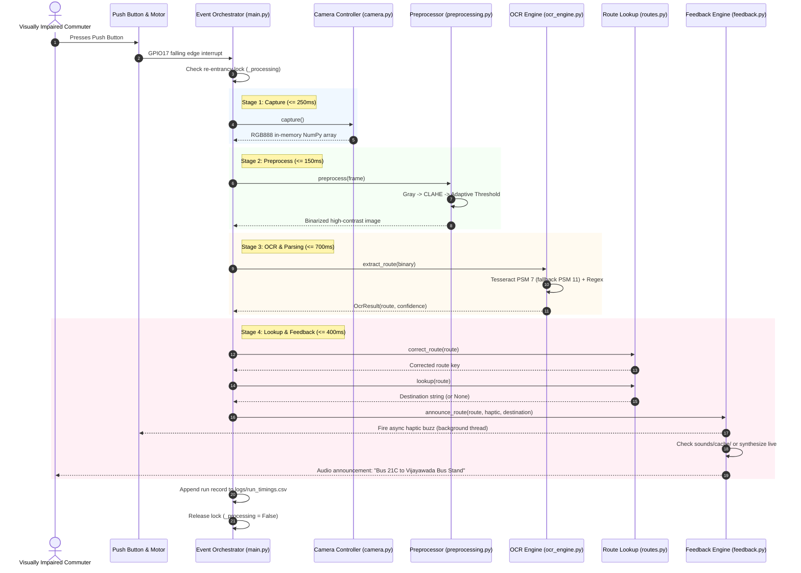

# Product Requirements Document (PRD)

## Edge-OCR & Audio-Tactile Bus Route Identifier

**Document Version:** 1.0  
**Status:** Approved / Active Baseline  
**Target Platform:** Raspberry Pi Zero 2 W (Embedded Linux)  
**Primary Domain:** Assistive Technology / Edge AI / Computer Vision  

---

## 1. Executive Summary

### 1.1 Vision & Mission
The **Edge-OCR & Audio-Tactile Bus Route Identifier** is a dedicated, wearable/handheld assistive edge device designed to empower visually impaired and blind individuals to independently navigate public transit. By pointing the device toward approaching buses and pressing a single tactile button, users receive immediate spoken announcements (e.g., *"Bus 21C to Vijayawada Bus Stand"*) accompanied by distinct haptic vibration patterns.

### 1.2 Core Value Proposition
- **100% Offline Autonomy:** Does not rely on cellular networks, cloud APIs, transit server sync, or GPS signals. Operates reliably during transit blackouts, underground stations, and remote bus stops.
- **Ultra-Low Latency Budget (< 1.5 seconds):** Optimized end-to-end execution from button actuation to audio-tactile output, critical for identifying approaching buses traveling at 20–40 km/h.
- **Privacy by Design:** Zero persistent image retention; frames are processed in-memory (RAM) and immediately discarded.
- **Sensory-Aware Feedback:** Dual-channel feedback (audio TTS + multi-pattern haptics) guarantees unambiguous communication even in noisy urban traffic.

---

## 2. Problem Statement & User Personas

### 2.1 The Problem
Public bus systems frequently lack reliable digital tracking, and route display boards (both LED matrix and static printed acrylic boards) are purely visual. Visually impaired commuters face:
1. **Safety Risks:** Approaching moving buses or stepping into traffic lanes to ask drivers or fellow commuters.
2. **Dependence:** Relying on strangers at bus stops who may be absent, distracted, or unhelpful.
3. **App Limitations:** Existing smartphone transit apps depend on GPS (which suffers from multi-path interference and delay) and cellular data, and fail when regional transit agencies do not broadcast live vehicle locations.
4. **Smartphone Friction:** Using a phone camera app with a screen reader while holding a white cane or guide dog harness is cumbersome and slow.

### 2.2 Target User Personas
- **Primary Persona: The Daily Commuter (Legally Blind / Low Vision)**
  - Uses public transit daily for work or education.
  - Requires hands-free or single-hand operation while carrying a cane.
  - Needs rapid, reliable verification of oncoming buses before the bus stops or passes by.
- **Secondary Persona: Elder Commuter with Degenerative Vision**
  - May have mild hearing impairment and struggle with smartphone touchscreen interfaces.
  - Benefits strongly from haptic confirmation and loud, high-clarity voice output.

---

## 3. Product Principles & Success Metrics

### 3.1 Guiding Principles
1. **Safety First:** A false announcement is worse than saying "unclear". False confidence leads to boarding the wrong bus.
2. **Deterministic Latency:** Every millisecond counts. In-memory buffers are prioritized over file I/O.
3. **Graceful Degradation:** The device must fail safely into simplified fallback states (e.g., announce route number without destination if uncataloged; announce low-confidence prompt if board is occluded).

### 3.2 Key Performance Indicators (KPIs)

| Metric | Target | Minimum Acceptable | Measurement Method |
| :--- | :--- | :--- | :--- |
| **End-to-End Latency** | $\le 1.20\text{ s}$ | $\le 1.50\text{ s}$ | Logged in `logs/run_timings.csv` |
| **OCR Recognition Accuracy** | $\ge 92\%$ | $\ge 85\%$ | Offline benchmark against ground-truth dataset |
| **Battery Life (Active Use)** | $\ge 4\text{ hours}$ (continuous) | $\ge 2.5\text{ hours}$ | Under periodic button press load |
| **Boot-to-Ready Time** | $\le 18\text{ s}$ | $\le 25\text{ s}$ | From cold boot to service ready state |
| **False Positive Boarding Rate** | $\le 1\%$ | $\le 3\%$ | Tested on noisy / non-route images |

---

## 4. Hardware Bill of Materials (BOM) & Pinout

### 4.1 Hardware Architecture
```
                         +-----------------------------+
                         |    Raspberry Pi Zero 2 W    |
                         |  (Quad-Core Cortex-A53 1GHz |
                         |       512MB LPDDR2 RAM)     |
                         +--------------+--------------+
                                        |
       +-----------------+--------------+---------------+------------------+
       | CSI Ribbon      | I2S Bus      | GPIO (BCM)    | I2C Bus          |
       v                 v              v               v                  v
+--------------+  +---------------+  +------------+  +-------------+  +-------------+
| Pi Camera    |  | MAX98357A     |  | Push Button|  | Vibration   |  | ADS1115     |
| (OV2640 /    |  | I2S Class-D   |  | (GPIO 17)  |  | Motor Driver|  | 16-bit ADC  |
| Camera v2)   |  | Amp + Speaker |  | w/ Pull-Up |  | (GPIO 27)   |  | (SDA2/SCL3) |
+--------------+  +---------------+  +------------+  +-------------+  +------+------+
                                                                             | Divider
                                                                      +------+------+
                                                                      | 3.7V LiPo   |
                                                                      | Battery     |
                                                                      +-------------+
```

### 4.2 Pin Mapping (BCM Convention)

| Signal / Peripheral | BCM Pin | Physical Pin | Direction | Description |
| :--- | :---: | :---: | :---: | :--- |
| **Button Trigger** | GPIO17 | Pin 11 | Input | Momentary switch to GND, internal pull-up enabled |
| **Haptic Motor Gate** | GPIO27 | Pin 13 | Output | Drives NPN (2N2222) or N-ch MOSFET with flyback diode |
| **Status LED** (Opt.) | GPIO22 | Pin 15 | Output | Optical indicator during active OCR cycle |
| **I2S BCLK** | GPIO18 | Pin 12 | Output | Bit clock for MAX98357A DAC |
| **I2S LRC / Word** | GPIO19 | Pin 35 | Output | Left/Right frame clock |
| **I2S DIN** | GPIO21 | Pin 40 | Output | Audio data stream out to DAC |
| **I2C SDA** | GPIO2 | Pin 3 | I/O | ADS1115 ADC data |
| **I2C SCL** | GPIO3 | Pin 5 | Output | ADS1115 ADC clock |
| **VCC 5V Rail** | 5V | Pin 2/4 | Power | Powers MAX98357A amplifier |
| **VCC 3.3V Rail** | 3.3V | Pin 1/17 | Power | Sensor / logic power |
| **GND** | GND | Pin 6/9/14... | Ground | Common system ground |

---

## 5. Functional Requirements

### 5.1 Pipeline Triggering & Event Handling
- **FR-1.1 (Debounced Trigger):** The system must register button presses with a debounce window of 50ms (`BUTTON_BOUNCE_TIME = 0.05`).
- **FR-1.2 (Re-trigger Guard):** Once triggered, the pipeline must discard secondary presses during active execution and enforce a 1.5s cooldown (`BUTTON_HOLD_IGNORE_WINDOW = 1.5`) to prevent pipeline re-entrancy and stuttering.
- **FR-1.3 (Warm Bootstrapping):** Process components (`CameraController`, `HapticMotor`, `RouteLookup`, `BatteryMonitor`) must be initialized once on startup to avoid cold-start overheads (which cost 300–800ms).

### 5.2 Fast In-Memory Image Capture
- **FR-2.1 (Zero Disk Write):** Frame capture must use Picamera2's `capture_array()` directly into memory as an RGB888 NumPy array, skipping filesystem encode/decode to save 80–150ms.
- **FR-2.2 (Resolution Constraint):** Resolution is fixed at $640 \times 480\text{ px}$. OCR accuracy on route boards plateaus well below 1080p, while higher resolutions heavily penalize CPU preprocessing latency.
- **FR-2.3 (ROI Cropping):** Support a configurable Region-of-Interest (ROI) tuple `(x, y, w, h)` to focus on route display board areas when housed in standardized mounts.

### 5.3 Deterministic OpenCV Preprocessing
- **FR-3.1 (Grayscale Conversion):** Convert RGB888 frames to single-channel 8-bit grayscale to discard 66% of unnecessary color data.
- **FR-3.2 (CLAHE Lighting Equalization):** Apply Contrast Limited Adaptive Histogram Equalization (`clipLimit = 3.0`, `tileGridSize = (8, 8)`) to eliminate severe outdoor lighting artifacts, sun glare, and bus body shadows.
- **FR-3.3 (Adaptive Gaussian Thresholding):** Apply adaptive Gaussian binarization (`blockSize = 31`, `C = 12`) to handle non-uniform side-lit boards.
- **FR-3.4 (Zero Blur Default):** Blurring/denoising steps must remain disabled by default to save 40–80ms of CPU budget.

### 5.4 OCR & Route Number Token Parsing
- **FR-4.1 (Single-Line PSM Primary Pass):** Execute Tesseract using Page Segmentation Mode 7 (`--psm 7`) with an alphanumeric whitelist:  
  `0123456789ABCDEFGHIJKLMNOPQRSTUVWXYZ/- `
- **FR-4.2 (Sparse-Text Fallback Pass):** If PSM 7 returns no text (e.g. board frame borders or logo interference), automatically fall back to PSM 11 (`--psm 11`).
- **FR-4.3 (Regex Extraction):** Filter raw OCR text against the route pattern `\b\d{1,3}[A-Z]?(?:/\d{1,2})?\b`, selecting the longest candidate token.
- **FR-4.4 (Confidence Gating):** Require a minimum mean word confidence score of $45\%$ (`OCR_MIN_CONFIDENCE = 45`). Below this score, route identity is withheld and an advisory message is triggered.

### 5.5 Multi-City Offline Route & Destination Lookup
- **FR-5.1 (Local Datasets):** Load city datasets from CSV files (`data/routes/{CITY}.csv`) structured with `route,destination` columns.
- **FR-5.2 (Zero-Disk Hot Path):** Datasets must be loaded into memory at system boot. Runtime disk reads during button press are strictly prohibited.
- **FR-5.3 (Fuzzy Error Correction):** Correct noisy OCR character errors (e.g., misreading `"3O5"` instead of `"305"`, or lowercase `"23a"` instead of `"23A"`) using `difflib.get_close_matches` with a 0.6 similarity threshold against known routes. If a route already matches a valid entry, it must not be replaced.
- **FR-5.4 (Graceful Fallback):** If no matching destination exists, or if `CITY` specifies an uncataloged city, announce the plain route number without crashing.

### 5.6 Multimodal Audio-Tactile Feedback
- **FR-5.1 (Audio Caching):** Check `sounds/cache/{route}.wav` prior to invoking live synthesis. Pre-rendered clips eliminate 30–150ms of synthesis latency for common routes.
- **FR-5.2 (Dual TTS Engines):** Support low-latency synthesis via `espeak-ng` (default, 30–100ms) with configuration toggle to neural `Piper` TTS.
- **FR-5.3 (Non-Blocking Haptics):** Vibration patterns must execute asynchronously in a background daemon thread so they never block audio playback or the event loop.
- **FR-5.4 (Tactile Language):**
  - *Success (Valid Route):* Single short pulse (150ms on).
  - *Low Confidence:* Two quick pulses (80ms on / 80ms off $\times 2$).
  - *Error / No Text:* One long pulse (400ms on).
  - *Low Battery Warning:* Two long distinct pulses (500ms on / 200ms off $\times 2$).

### 5.7 Power Management & Health Monitoring
- **FR-7.1 (Background Polling):** Continuously monitor battery voltage off the hot path (every 60s) via ADS1115 ADC.
- **FR-7.2 (Threshold Alerts):**
  - Low Battery: $\le 3.55\text{V}$ (~20% capacity remaining).
  - Critical Battery: $\le 3.40\text{V}$ (~5% capacity remaining).
- **FR-7.3 (OS Power Tuning):** Boot script `scripts/power_saving.sh` sets the CPU governor to `ondemand`, disables HDMI circuitry (~30mA savings), and disables Bluetooth.

---

## 6. System Architecture & Data Flow



---

## 7. Latency Budget Breakdown

Total Budget Target: **$\le 1.500\text{ seconds}$**

| Stage | Target Budget | Typical Realized (Pi Zero 2 W) | Fallback / Worst Case |
| :--- | :---: | :---: | :---: |
| **1. Frame Capture** | $0.250\text{ s}$ | $0.090 - 0.160\text{ s}$ | $0.220\text{ s}$ (exposure settling) |
| **2. Preprocessing** | $0.150\text{ s}$ | $0.060 - 0.110\text{ s}$ | $0.140\text{ s}$ (large frame / upscale) |
| **3. OCR & Parsing** | $0.700\text{ s}$ | $0.220 - 0.450\text{ s}$ | $0.680\text{ s}$ (PSM 7 miss + PSM 11 run) |
| **4. Route Lookup** | $0.005\text{ s}$ | $< 0.001\text{ s}$ | $0.003\text{ s}$ (difflib search) |
| **5. Feedback & Audio**| $0.400\text{ s}$ | $0.020 - 0.040\text{ s}$ (cached)<br>$0.080 - 0.250\text{ s}$ (espeak live) | $0.450\text{ s}$ (Piper unaccelerated) |
| **Total End-to-End** | **$1.500\text{ s}$** | **$0.400 - 0.950\text{ s}$** | **$1.490\text{ s}$** |

---

## 8. Non-Functional Requirements (NFRs)

### 8.1 Reliability & Robustness
- **Headless Auto-Recovery:** The application runs as a systemd service (`bus-route-identifier.service`) with `Restart=always` and `RestartSec=2`.
- **Fault-Tolerant Mocking:** The software automatically identifies missing GPIO factories or sound binaries and falls back to desktop simulation modes without crashing.
- **Non-blocking Haptics:** Motor pulse timing threads run in daemon mode; failure of a GPIO driver will not block audio or cause deadlocks.

### 8.2 Security & Privacy
- **Zero Local Image Logging:** Captured raw images are held in volatile RAM only. No images of commuters, vehicles, or bystanders are written to the SD card.
- **Read-Only Data Storage:** Route tables in `data/routes/` are read-only at runtime.

### 8.3 Ergonomics & Physical Enclosure
- **Orientation:** Lens positioned with a $5^\circ - 10^\circ$ upward tilt to capture route boards mounted above bus windshields from a standing commuter's vantage point.
- **Button Differentiation:** The primary actuation button must have a convex, high-travel tactile switch ($> 1.5\text{ mm}$ travel, $> 2.5\text{ N}$ force) easily located by touch.

---

## 9. Development & Testing Strategy

### 9.1 Three-Tier Testing Matrix
1. **Tier 1 (Host PC Simulation):**
   - Run `tools/test_local_pipeline.py` on macOS/Windows/Linux without hardware.
   - Validates event routing, regex extraction, fuzzy route matching, and destination mapping.
2. **Tier 2 (Offline Dataset Benchmarking):**
   - Run `tools/benchmark.py --images test_images/ --ground-truth truth.csv`.
   - Sweeps preprocessing hyper-parameters (`CAMERA_ROI`, `ADAPTIVE_THRESH_BLOCK_SIZE`, `UPSCALE_FACTOR`) against collected transit photos.
3. **Tier 3 (Target Hardware Verification):**
   - Direct verification on Pi Zero 2 W over SSH (`libcamera-hello`, `speaker-test`, foreground `main.py` runs).
   - Statistical evaluation using `tools/analyze_logs.py` to calculate 50th, 90th, and 95th percentile latency numbers from real field tests.

---

## 10. Product Roadmap & Future Enhancements

### Phase 1: Core System (Current Baseline)
- [x] In-memory Picamera2 capture pipeline.
- [x] Fast CLAHE + adaptive binarization OpenCV preprocessing.
- [x] Tesseract PSM 7 + PSM 11 dual-pass engine with regex filtering.
- [x] Offline multi-city route-to-destination database with fuzzy OCR correction.
- [x] Pre-rendered WAV cache and non-blocking haptic driver.
- [x] OS-level idle power reduction scripts and systemd services.

### Phase 2: Hardware Enclosure & Field Calibration (Near-Term)
- [ ] 3D-printable ergonomic handheld/chest-mount enclosure CAD files.
- [ ] Field dataset expansion for additional metropolitan bus networks.
- [ ] Wiring and integration of hardware LiPo fuel gauge / ADS1115 battery circuit.
- [ ] Lens calibration sweeps for acrylic vs. LED matrix route displays.

### Phase 3: Hardware Acceleration & Neural Upgrades (Long-Term)
- [ ] Evaluation of Raspberry Pi 5 / Hailo-8L or Coral NPU for lightweight YOLO-based route board localization before OCR.
- [ ] OnnxRuntime-optimized ultra-low footprint text recognizer replacing Tesseract.
- [ ] Dual-mic noise-canceling beamforming for voice command queries (e.g. *"Is this bus 21C?"*).
